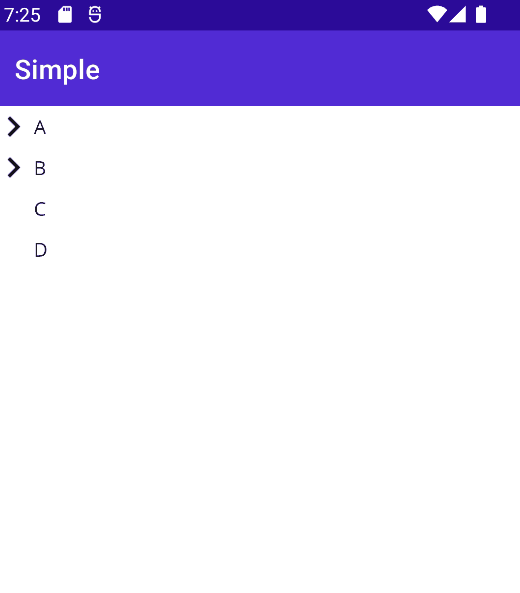

# TreeView.Maui
 A simple treeview control for MAUI

## Showcase





## Getting Started

- Install `TreeView.Maui` from NuGet. _(coming soon)_

- Create your nodes with `TreeViewNode` class.

    ```csharp
    public class MainPageViewModel : BindableObject
    {
        public ObservableCollection<TreeViewNode> Nodes { get; set; } = new();

        public MainPageViewModel()
        {
            Nodes.Add(new TreeViewNode("A")
            {
                Children =
                {
                    new TreeViewNode("A.1"),
                    new TreeViewNode("A.2"),
                }
            });
            Nodes.Add(new TreeViewNode("B")
            {
                Children =
                {
                    new TreeViewNode("B.1")
                    {
                        Children =
                        {
                            new TreeViewNode("B.1.a"),
                            new TreeViewNode("B.1.b"),
                            new TreeViewNode("B.1.c"),
                            new TreeViewNode("B.1.d"),

                        }
                    },
                    new TreeViewNode("B.2"),
                }
            });
            Nodes.Add(new TreeViewNode("C"));
            Nodes.Add(new TreeViewNode("D"));
        }
    }
    ```

- Use `TreeView` in XAML page and bind the noes as `ItemsSource`

    ```xml
        <t:TreeView ItemsSource="{Binding Nodes}">
        </t:TreeView>
    ```

---

### Use-cases

- Lazy-load

    ```csharp

        IEnumerable<TreeViewNode> GetNodes(string dir)
        {
            var directories = Directory.GetDirectories(dir);
            foreach (string d in directories)
            {
                yield return new TreeViewNode
                {
                    Name = d.Split(Path.DirectorySeparatorChar).LastOrDefault(),
                    Value = d,
                    // 👇 You can define func instead of initializing entire tree.
                    GetChildren = (node) => GetNodes(node.Value.ToString())
                };
            }
            var files = Directory.GetFiles(dir);

            foreach (string f in files)
            {
                var node = new TreeViewNode
                {
                    Name = f.Split(Path.DirectorySeparatorChar).LastOrDefault(),
                    Value = f,
                };
                yield return node;
            }
        }
    ```

- Using a custom item template

    ```xml
    <t:TreeView ItemsSource="{Binding Nodes}">
        <t:TreeView.ItemTemplate>
            <DataTemplate>
                <HorizontalStackLayout>
                    <Image Source="folder.png"/>
                    <Label Text="{Binding Name}">
                    <Image source="check.png" IsVisible="{Binding IsSelected}">
                </HorizontalStackLayout>
            </DataTemplate>
        </t:TreeView.ItemTemplate>
    </t:TreeView>
    ```

- Using a custom class

    ```csharp
    public class MyNode : TreeViewNode
    {
        public string Color { get; set; }
        // Your custom properties here...
    }
    ```

    ```csharp
    public class MyViewModel
    {
        public List<MyNode> Nodes => new ()
        {
            new MyNode { /* ... */},
            new MyNode { /* ... */},
        }
    }
    ```

    ```xml
    <t:TreeView ItemsSource="{Binding Nodes}">
        <t:TreeView.ItemTemplate>
            <DataTemplate>
                <!-- You can bind your custom properties 👇 -->
                <Label Text="{Binding Name}" Color="{Binding Color}">
            </DataTemplate>
        </t:TreeView.ItemTemplate>
    </t:TreeView>
    ```


## Roadmap

- [ ] Lazy-load Performance improvements
  - [ ] Async API for lazy loading
  - [ ] Activity indicator on Long-running process _(http request for getting child nodes)_
- [ ] Selection
  - [ ] Single Selection
  - [ ] Multiple Selection
- [ ] Include it in [InputKit](https://github.com/enisn/Xamarin.Forms.InputKit)

